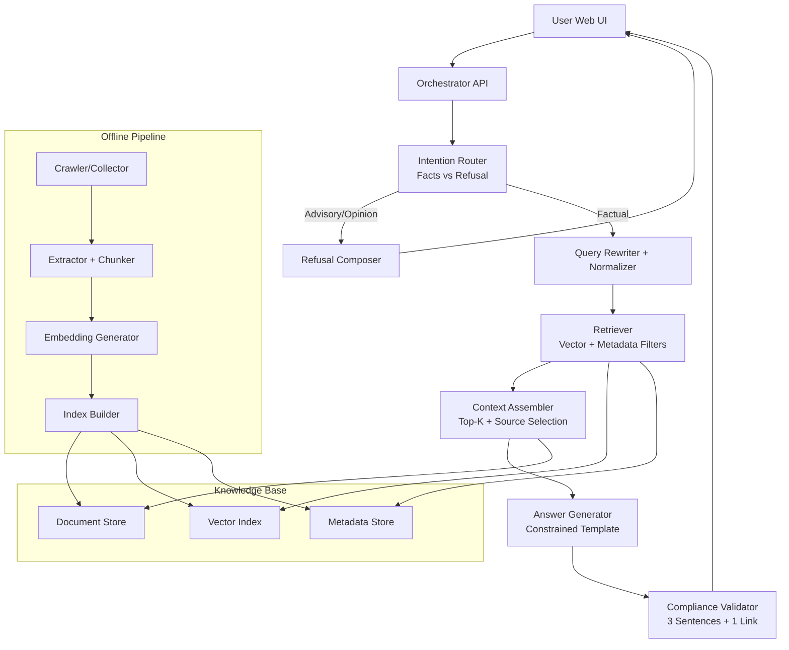
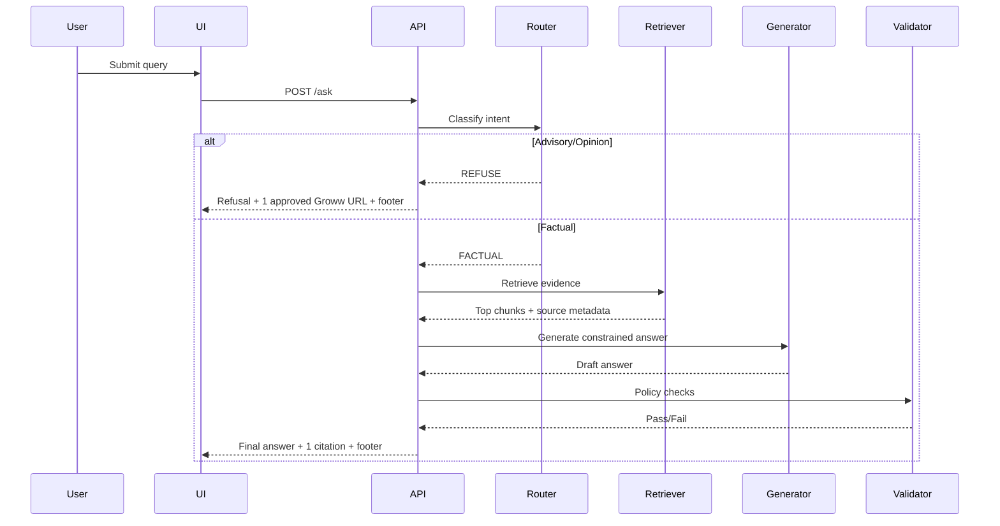

# Mutual Fund FAQ Assistant - Detailed Architecture

## 1. Purpose
This document defines the technical architecture for a facts-only Mutual Fund FAQ Assistant that answers objective, verifiable questions using only the 7 approved Groww scheme URLs.

The assistant is designed to:
- Retrieve mutual-fund facts from approved documents only
- Refuse advisory or opinion-seeking prompts
- Return concise responses with exactly one citation link
- Show source freshness as: Last updated from sources: <date>

## 2. Product Guardrails

### 2.1 In-Scope Query Types
- Expense ratio
- Exit load
- Minimum SIP / minimum investment amount
- Lock-in period (for ELSS and applicable schemes)
- Riskometer category
- Benchmark index
- Operational help (statement download, capital gains report download)

### 2.2 Out-of-Scope Query Types
- Investment advice
- Fund recommendations
- Return predictions
- Performance ranking and comparisons
- Portfolio suitability guidance

### 2.3 Hard Response Constraints
- Maximum 3 sentences in answer body
- Exactly one citation URL in each answer
- Mandatory footer: Last updated from sources: <date>

## 3. Source Governance

### 3.1 Allowed Domain and URL Allowlist
- Allowed domain: groww.in
- Allowed source URLs (exact allowlist):
  - https://groww.in/mutual-funds/hdfc-mid-cap-fund-direct-growth
  - https://groww.in/mutual-funds/hdfc-equity-fund-direct-growth
  - https://groww.in/mutual-funds/hdfc-small-cap-fund-direct-growth
  - https://groww.in/mutual-funds/hdfc-gold-etf-fund-of-fund-direct-plan-growth
  - https://groww.in/mutual-funds/hdfc-large-and-mid-cap-fund-direct-growth
  - https://groww.in/mutual-funds/hdfc-large-cap-fund-direct-growth
  - https://groww.in/mutual-funds/hdfc-retirement-savings-fund-equity-plan-direct-growth

### 3.2 Blocked Domains
- Blogs
- News summaries
- Community forums
- Unverified third-party aggregators
- Any URL not in the 7-link allowlist above

### 3.3 Source Intake Rules
- Each URL is tagged with source_type: scheme_page
- HTTP status must be 200 before indexing
- Extracted content must include retrieval timestamp and canonical URL
- Duplicate content chunks are deduplicated by content hash

## 4. High-Level System Architecture

## 5. Logical Components

### 5.1 Web UI (Minimal)
Responsibilities:
- Display welcome text
- Show exactly three example factual questions
- Show disclaimer: Facts-only. No investment advice.
- Render answer, single citation link, and last updated footer

Suggested implementation:
- Option A: Streamlit single-page app
- Option B: Lightweight React app with simple API backend

### 5.2 Orchestrator API
Responsibilities:
- Receive user query
- Run policy checks and route query flow
- Invoke retrieval, generation, validation, and formatting
- Return a structured response envelope

Suggested endpoints:
- POST /ask
- GET /health
- GET /sources/status

### 5.3 Intention Router
Responsibilities:
- Detect advisory language and non-factual intent
- Route to refusal flow for prohibited requests

Method:
- Deterministic keyword/rule pass (fast and auditable)
- Optional small classifier fallback for ambiguous intent

Example advisory indicators:
- should I invest
- best fund
- better fund
- recommend
- high returns

### 5.4 Retrieval Layer
Responsibilities:
- Convert normalized query to embeddings
- Retrieve top-k chunks from vector index
- Apply metadata filters by allowed source types/domains
- Return candidates with scores and source URLs

Retrieval policy:
- top_k_initial = 8
- rerank_top_k = 3
- final_context_chunks = 2 to 3
- enforce at least one chunk from high-authority source class for sensitive fields (expense ratio, exit load)

### 5.5 Context Assembler
Responsibilities:
- Select the best minimal evidence set
- Ensure all selected chunks map to a single final citation URL
- Attach source date and content freshness metadata

Single-citation strategy:
- Pick highest-confidence chunk family from one canonical URL
- If top chunks come from multiple URLs, select one with strongest evidence and discard cross-source fragments for final answer generation

### 5.6 Answer Generator
Responsibilities:
- Produce factual answer only from provided context
- Avoid speculation and advisory language
- Keep output concise and neutral

Generation constraints:
- Maximum 3 sentences
- No comparisons unless explicitly factual and present in single source
- If answer missing in context, return controlled not-found response with one link from the approved Groww URL allowlist

### 5.7 Compliance Validator
Responsibilities:
- Verify response policy before returning to user

Validation checks:
- Sentence count <= 3
- Exactly one URL present
- No advisory phrases
- Footer present with date format
- URL belongs to the approved 7-URL allowlist

On failure:
- Regenerate once with stricter template
- If still invalid, fall back to refusal-safe response with one approved Groww URL

### 5.8 Refusal Composer
Responsibilities:
- Return polite refusal for advisory queries
- Explain facts-only boundary
- Provide one link from the approved Groww URL allowlist

Refusal template:
- Sentence 1: limitation statement
- Sentence 2: what user can ask instead
- Sentence 3: one educational link guidance

## 6. Data Pipeline Architecture

### 6.1 Ingestion Workflow
1. URL seeding from the fixed list of 7 approved Groww scheme pages
2. Fetch HTML/PDF content
3. Extract text (PDF parser + HTML cleaner)
4. Normalize sections and headings
5. Chunk text with overlap
6. Generate embeddings
7. Upsert vectors + metadata + raw references

### 6.2 Chunking Strategy
- Chunk size: 500 to 800 tokens
- Overlap: 80 to 120 tokens
- Preserve section headers in chunk metadata
- Keep table-derived lines normalized for fields like expense ratio, exit load, and benchmark

### 6.3 Metadata Schema
Each chunk stores:
- chunk_id
- document_id
- scheme_name
- fund_category
- source_type
- source_url
- source_domain
- effective_date (if present in document)
- crawled_at
- content_hash
- text

## 7. Storage and Indexing

### 7.1 Document Store
Purpose:
- Store cleaned chunk text and source references

Suggested options:
- SQLite (local development)
- PostgreSQL (production)

### 7.2 Vector Store
Purpose:
- Semantic retrieval over chunk embeddings

Suggested options:
- ChromaDB (persistent local vector database)
- Chroma or pgvector (portable production path)

### 7.3 Metadata Store
Purpose:
- Fast filtering by scheme, source type, and approved URL allowlist

Implementation:
- Same relational store as document store using indexed columns

## 8. Query-Time Processing Flow

## 9. Prompt and Policy Design

### 9.1 System Prompt Objectives
- You are a facts-only mutual fund FAQ assistant
- Use only retrieved context
- Do not provide advice or recommendations
- If context is insufficient, say information is not found in current official sources

### 9.2 Output Template
- Answer body (max 3 sentences)
- Citation: <single URL>
- Last updated from sources: <YYYY-MM-DD>

### 9.3 Refusal Prompt Behavior
- Be polite
- Mention limitations explicitly
- Suggest factual alternatives
- Include one approved Groww URL

## 10. Security and Privacy Architecture

### 10.1 Data Handling
- No user identity collection
- Do not accept or store PAN, Aadhaar, account number, OTP, phone, or email
- Use stateless request handling where possible

### 10.2 Input Protection
- Query length limits
- URL sanitization in output
- Prompt-injection resistant design by isolating retrieved context and strict output validator

### 10.3 Logging Policy
- Log only technical telemetry: latency, retrieval hit counts, validation pass/fail
- Avoid storing raw sensitive user inputs
- Redact potential personal data patterns if logs are enabled

## 11. Observability and Quality Controls

### 11.1 Metrics
- Retrieval precision at top-k (manual evaluation set)
- Refusal precision for advisory prompts
- Response-format compliance rate
- Citation validity rate
- Unknown-answer rate
- End-to-end latency

### 11.2 Evaluation Set
Create a small benchmark set of:
- 30 factual questions
- 15 advisory/refusal questions
- 10 boundary/ambiguous questions

Track for each run:
- Correctness
- Citation relevance
- Constraint adherence (3 sentences, one link, footer)

### 11.3 Alert Conditions
- Citation count not equal to 1
- Response sentence count > 3
- Non-allowlisted URL returned
- Refusal miss on advisory query

## 12. Deployment Blueprint (VS Code Friendly)

### 12.1 Local Development
- Python backend service for ingestion + API
- Optional Streamlit frontend for minimal UI
- Local vector store and SQLite for quick iteration

### 12.2 Environment Variables
- LLM_PROVIDER
- LLM_MODEL
- EMBEDDING_MODEL
- VECTOR_DB_PATH (persistent Chroma database directory)
- ALLOWED_SOURCE_URLS
- DEFAULT_REFUSAL_LINK

### 12.3 Run Profiles
- ingest: crawl and index approved URLs
- serve-api: run orchestrator endpoints
- serve-ui: run minimal user interface
- evaluate: run benchmark suite and compliance checks

## 13. Suggested Repository Structure

- docs/
  - problemStatement.txt
  - problemStatement.md
  - architecture.md
  - implementation.md
  - implementation-plan.md
  - edge-case.md
  - eval.md
  - source_inventory.md
- data/
  - raw/
  - processed/
- ingestion/
  - fetch.py
  - extract.py
  - chunk.py
  - index.py
- app/
  - api.py
  - orchestrator.py
  - router.py
  - retriever.py
  - generator.py
  - validator.py
  - refusal.py
- ui/
  - app.py
- tests/
  - test_refusal.py
  - test_format_compliance.py
  - test_retrieval_smoke.py

## 14. Failure Modes and Mitigations

1. Stale source facts
- Mitigation: scheduled re-ingestion and source freshness checks

2. Hallucinated claims
- Mitigation: retrieval-grounded generation + strict validator + unknown fallback

3. Multi-source leakage in one answer
- Mitigation: single-citation context assembler policy

4. Advisory leakage
- Mitigation: deterministic intent router + refusal templates + post-check classifier

5. Broken citation links
- Mitigation: link health check during ingestion and at answer-time

## 15. Known Limitations
- Answers are limited to information present in curated official sources
- Assistant intentionally does not optimize for conversational depth
- Some facts may vary by document revision date; user sees latest indexed date in footer

## 16. Implementation Milestones

1. Source curation and ingestion pipeline
2. Retriever + metadata filters
3. Intent router and refusal flow
4. Answer generation with strict output template
5. Compliance validator and fallback logic
6. Minimal UI and examples
7. Evaluation harness and metrics dashboard

## 17. Definition of Done
The architecture is considered successfully implemented when:
- Factual queries are answered accurately from official sources
- Advisory queries are refused consistently and politely
- Every response includes exactly one valid citation link
- Every response includes Last updated from sources footer
- UI remains minimal, clear, and compliant with facts-only disclaimer
